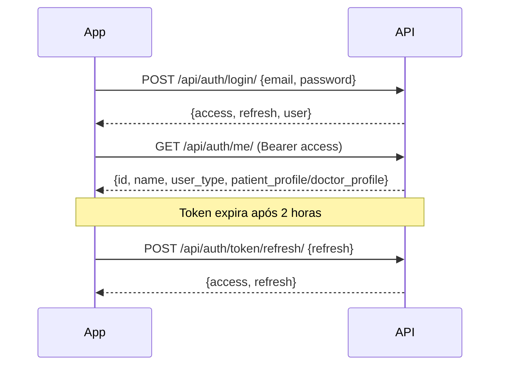

# BemGestar — Backend Django REST API

## O que foi criado

Backend completo de telemonitoramento gestacional usando **Django 6 + Django REST Framework + JWT**.

---

## Estrutura do Projeto

```
bem-gestar/
├── bemgestar/          # Config principal Django
│   ├── settings.py     # JWT, CORS, DRF, apps
│   └── urls.py         # Roteamento principal
├── apps/
│   ├── accounts/       # Usuários, autenticação, perfis
│   ├── monitoring/     # Sinais vitais, sintomas, score de risco, alertas
│   ├── consultations/  # Consultas, receitas, exames
│   ├── messaging/      # Mensagens paciente ↔ médico
│   └── education/      # Biblioteca educacional
├── seed.py             # Dados de teste
├── requirements.txt
└── .env
```

---

## Como Executar

```bash
# Ativar venv e iniciar servidor
cd /home/lucaslira/bem-gestar
venv/bin/python manage.py runserver

# Admin disponível em: http://localhost:8000/admin/
# API disponível em:   http://localhost:8000/api/
```

---

## Credenciais de Teste

| Papel | Email | Senha |
|---|---|---|
| Admin | admin@bemgestar.com | admin123@ |
| Médica (CRM validado) | medico@bemgestar.com | medico123@ |
| Paciente (vinculada à médica) | paciente@bemgestar.com | paciente123@ |

---

## Endpoints da API

### 🔐 Autenticação (`/api/auth/`)

| Método | Rota | Descrição | Acesso |
|---|---|---|---|
| POST | `/register/patient/` | Cadastro de paciente | Público |
| POST | `/register/doctor/` | Cadastro de médico | Público |
| POST | `/login/` | Login JWT | Público |
| POST | `/token/refresh/` | Renovar token | Público |
| POST | `/logout/` | Invalidar token | Auth |
| GET/PUT/PATCH | `/me/` | Perfil do usuário | Auth |
| POST | `/me/link-doctor/` | Vincular médico (por CRM) | Paciente |
| GET | `/patients/` | Listar pacientes vinculadas | Médico validado |
| GET | `/patients/{id}/` | Detalhe de uma paciente | Médico validado |

### 📊 Monitoramento (`/api/monitoring/`)

| Método | Rota | Descrição | Acesso |
|---|---|---|---|
| GET | `/vital-signs/` | Listar sinais vitais | Auth |
| POST | `/vital-signs/` | Registrar sinal vital (→ calcula score) | Paciente |
| GET | `/vital-signs/{id}/` | Detalhe | Auth |
| GET | `/symptoms/` | Listar sintomas | Auth |
| POST | `/symptoms/` | Registrar sintoma (→ calcula score) | Paciente |
| GET | `/risk-score/` | Histórico de scores | Auth |
| GET | `/risk-score/latest/` | Último score | Auth |
| GET | `/alerts/` | Listar alertas | Auth |
| POST | `/alerts/{id}/read/` | Marcar alerta como lido | Auth |
| GET | `/dashboard/` | Dashboard clínico completo | Médico validado |
| GET | `/timeline/?patient_id=` | Timeline de uma paciente | Médico validado |

### 🏥 Consultas (`/api/consultations/`)

| Método | Rota | Descrição | Acesso |
|---|---|---|---|
| GET | `/` | Listar consultas | Auth |
| POST | `/` | Agendar consulta | Médico validado |
| GET/PATCH | `/{id}/` | Detalhe/editar consulta | Auth |
| POST | `/{id}/cancel/` | Cancelar consulta | Auth |
| GET | `/prescriptions/` | Listar receitas | Auth |
| POST | `/prescriptions/` | Emitir receita | Médico validado |
| GET | `/prescriptions/{id}/` | Detalhe de receita | Auth |
| GET | `/exam-requests/` | Listar solicitações de exames | Auth |
| POST | `/exam-requests/` | Solicitar exame | Médico validado |
| GET | `/exam-requests/{id}/` | Detalhe de solicitação | Auth |

### 💬 Mensagens (`/api/messaging/`)

| Método | Rota | Descrição | Acesso |
|---|---|---|---|
| GET | `/conversations/` | Listar conversas | Auth |
| POST | `/conversations/start/` | Iniciar conversa | Auth |
| GET | `/conversations/{id}/messages/` | Mensagens de uma conversa | Auth |
| POST | `/conversations/{id}/messages/` | Enviar mensagem | Auth |
| POST | `/sync/` | Sincronizar mensagens offline | Auth |

### 📚 Educação (`/api/education/`)

| Método | Rota | Descrição | Acesso |
|---|---|---|---|
| GET | `/categories/` | Categorias de conteúdo | Auth |
| GET | `/contents/` | Conteúdos (filtrados por semana/risco) | Auth |
| GET | `/contents/{id}/` | Detalhe de conteúdo | Auth |
| GET | `/contents/slug/{slug}/` | Detalhe por slug | Auth |

---

## Fluxo de Autenticação



---

## Sistema de Score de Risco

O score (0–100) é calculado automaticamente sempre que a paciente registra um sinal vital ou sintoma.

| Score | Nível |
|---|---|
| 0–29 | 🟢 Baixo |
| 30–59 | 🟡 Médio |
| 60–79 | 🔴 Alto |
| 80–100 | 🚨 Crítico |

Alertas são criados automaticamente para:
- PA sistólica ≥ 140 mmHg
- PA sistólica ≥ 160 mmHg (urgente)
- SpO₂ ≤ 90% (urgente)
- Temperatura ≥ 37.8°C
- Sintomas graves ou de alto risco (sangramento, visão turva, etc.)

---

## Permissões Implementadas

| Classe | Descrição |
|---|---|
| `IsPatient` | Apenas pacientes autenticadas |
| `IsDoctor` | Apenas médicos autenticados |
| `IsValidatedDoctor` | Médicos com CRM validado pelo admin |
| `IsPatientOrValidatedDoctor` | Ambos com acesso válido |
| `IsOwnerOrDoctor` | Dono do registro ou médico vinculado |

---

## Suporte Offline

- Sinais vitais e sintomas têm campo `synced` (bool)
- Mensagens têm status `pending` → `sent` → `read`
- Endpoint `POST /api/messaging/sync/` aceita lista de mensagens pendentes para sincronização em lote

---

## Validação de CRM

1. Médico se cadastra → conta criada com `is_crm_validated=False`
2. Admin acessa `/admin/` → **DoctorProfile** → seleciona médicos → ação "Validar CRM"
3. Após validação: médico pode acessar dashboard, emitir receitas/exames, agendar consultas
